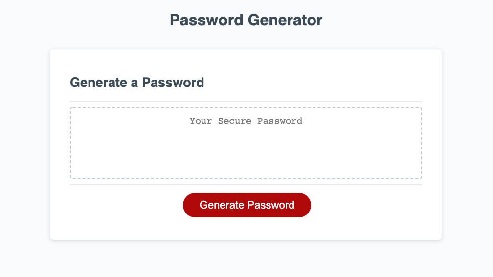

# Password Generator

* The live [web application](https://jeffmullen.github.io/password-generator/).

## Functionality

* Prompts users to input the length of their password.

  * Validates if the input is a number.

  * Validates if it is a number between 8 and 128.

* Requires users to choose character type options.

  * Validates whether options have been chosen.

* Randomly creates password based on password length and character types chosen.

## Webpage

